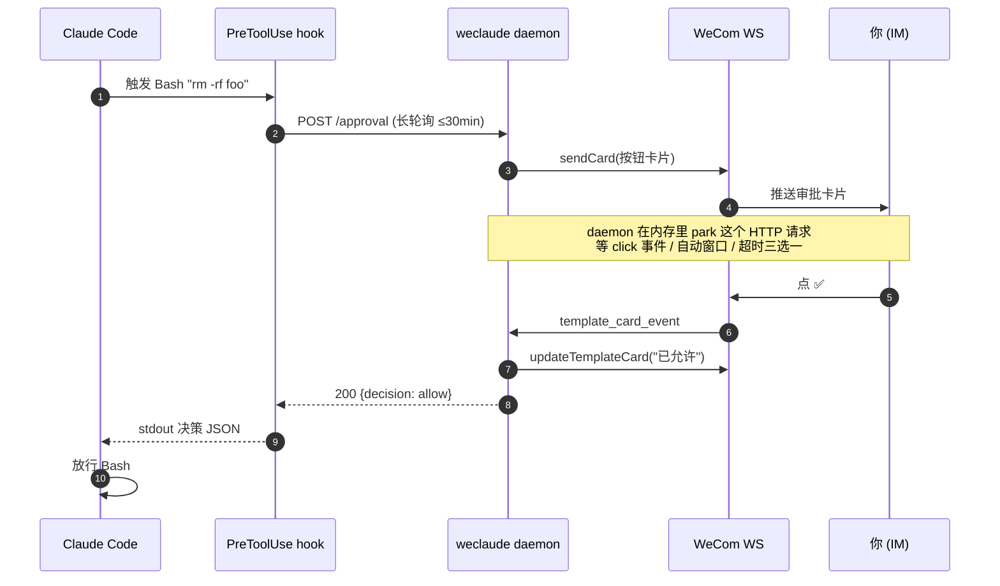
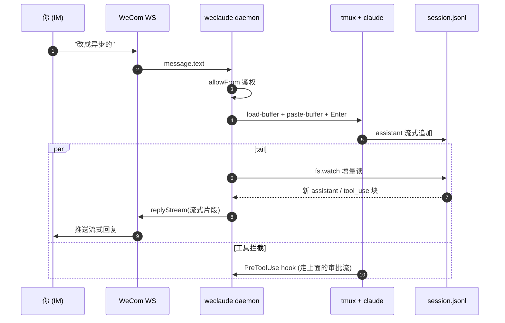

# weclaude

**把 Claude Code 装进企业微信。** 在地铁上、被窝里、开会摸鱼时，照样能跟你电脑上的 Claude 干活。

- 🛎 **远程审批** — Claude 要跑 `Bash` / `Edit`？审批卡片直推 IM，点 ✅/❌/⏱（放行 N 分钟）。
- 🪞 **会话镜像** — 你电脑上跑的 Claude 流式打字、tool_use、思考过程，实时同步到企业微信；IM 里发消息原样落进 CLI 输入框。
- 🖼 **图片直贴** — 企业微信发图，自动走 macOS 剪贴板 + tmux 粘贴，Claude 当贴图处理（不走 Read，不耗 token）。
- 🔍 **细节页** — 工具调用 / 审批请求都生成本地 HTML 详情页，IM 里点链接看完整 input / result / git diff。
- 📡 **MCP 主动推送** — Claude 通过 `wecom__send_markdown` / `wecom__send_card` / `wecom__ask_user` 主动汇报或问询。

---

## 快速开始

**前置**：macOS / Linux、Node ≥ 20、PATH 里能找到 `claude` 或 `claude-internal`、企业微信「智能机器人」的 `botId` + `secret`。镜像模式额外需要 `tmux`。

```bash
npm install -g weclaude
weclaude init
```

`init` 会交互式问你 4 个问题，把配置落到 `~/.weclaude/`：

| 问什么 | 落到哪 |
| --- | --- |
| botId / secret | `~/.weclaude/secrets.json` |
| 用哪个 Claude（`claude` / `claude-internal` / 自定义路径） | `~/.weclaude/config.jsonc` |
| 用哪种模式（`headless` / `mirror`，见下文） | `~/.weclaude/config.jsonc` |
| 是否开启 PreToolUse 远程审批 | `~/.weclaude/config.jsonc` |

然后自动：编译 → 注入 hook/MCP → 装常驻 daemon（macOS launchd / Linux systemd --user）→ 等 WebSocket 鉴权。

**最后一步：绑定默认会话。** CLI 提示后，**在企业微信里**给机器人发：

```
将本对话设置为默认会话
```

这是**唯一**绕过白名单的入口，10 分钟窗口，消费完立刻关。后续所有消息都按白名单鉴权。

---

## 两种模式怎么选

|  | `headless` | `mirror` 🌟 |
| --- | --- | --- |
| **怎么跑** | IM 来消息 → 后台 `claude -p` 跑一轮 | IM 来消息 → tmux 粘进活的 TUI |
| **CLI 看得见吗** | 看不见（headless 子进程） | 看得见（IM 消息像你自己敲进去的） |
| **状态续接** | 靠 `--resume <sid>` 续 session | 一对一绑定 IM 聊天 ↔ tmux 窗口，原地累计 |
| **流式输出** | 转发 assistant 文本块 | 完整流式：打字机、tool_use、思考过程都看得到 |
| **适合谁** | 简单单轮问答 / CI 类自动化 | 真·远程结对编程 |

镜像模式下，IM 里发 `/new` 直接开新 tmux 窗口 + 新 Claude 会话；`/clear` 清当前上下文；带图消息自动注入剪贴板。所有 IM 聊天共享一个 tmux session（默认名 `weclaude`），每个聊天一个独立 window，重启 daemon、关 tmux 都能自愈。

> 💡 **mirror 不要求你必须先在 CLI 里开 tmux**：在企业微信里直接发 `/new` 就能从零起一个新 tmux 窗口 + Claude 会话；甚至首次发任意消息都会自动 spawn + 绑定（首条消息既是绑定信号也是第一句 prompt）。回家打开终端 `tmux attach -t weclaude` 接管即可。

---

## 体验是什么样

**审批场景**：

> 你正在地铁上，电脑上的 Claude 想 `rm -rf node_modules` 重装。企业微信叮一声弹卡片：
>
> > 🛎 授权请求: Bash
> > `rm -rf node_modules`
> > [✅ 允许] [❌ 拒绝] [⏱ 5 分钟内自动允许]
>
> 你点 ✅，卡片立刻刷新成 `✅ Bash · 已允许`，电脑上的 Claude 解除阻塞继续跑。

**镜像场景**：

> 你 tmux 里开着 Claude 在写代码。出门后给机器人发：
>
> > 把刚才那个函数改成异步的
>
> 这条消息自动粘进 CLI 输入框 + 回车提交。Claude 的回应、调用了哪些工具、改了哪些文件，逐字流式推回你 IM。回家打开终端，对话一字不少都在那里。

---

## 消息是怎么同步的

**审批流**（`headless` / `mirror` 都走这条）：



**镜像流**（`mirror` 模式，IM ↔ tmux 双向）：



要点：
- daemon 是**唯一**和 WeCom 说话的进程，hook 和 MCP 都只是它的 HTTP 客户端
- 审批是**长轮询 + 内存 park**，没有 webhook、不依赖外网回调
- 镜像是**单向 paste + 单向 tail**：IM→tmux 走粘贴键，tmux→IM 走读 jsonl，两条管道独立、互不阻塞

---

## 常用命令

```bash
weclaude status              # 看 daemon + WS 健康
weclaude logs -f             # 实时日志
weclaude send <chat> <text>  # 主动推消息
weclaude reload              # 重启 daemon（改了配置后用）
weclaude unsync              # 卸载 hook/MCP（保留 daemon）
weclaude uninstall           # 完整卸载（先于 npm uninstall）
```

> ⚠️ **卸载顺序**：先 `weclaude uninstall` 再 `npm uninstall -g weclaude`。否则 launchd/systemd 会一直尝试拉起已删除的二进制。`~/.weclaude/` 下的 config/secrets 不会被清，二次安装可无缝复用。

---

## 常见问题

**Q: hook 不触发？**
`cat ~/.claude/settings.json | jq .hooks.PreToolUse`，没东西就跑 `weclaude sync` 重写。

**Q: 卡片点了没反应？**
企业微信卡片就地刷新只有 5 秒窗口，超时不刷新是正常的，决策本身仍然生效。

**Q: daemon 起不来？**
`weclaude logs -f` 看；常见是 `botId` / `secret` 写错卡在 WebSocket 鉴权。

**Q: 多机部署？**
`config.jsonc` 可以纳入 dotfiles；`secrets.json` 每台机器独立填。第二台机器跑 `weclaude init` 会跳过覆盖提示，但仍要重新走 claim 步骤拿本机 IM principal。

更多排错见 [docs/ONBOARDING.md](docs/ONBOARDING.md)。

---

## 架构一瞥

三个进程走 `127.0.0.1:17890` + `~/.weclaude/`：

```
 WeCom ── WebSocket ──► daemon (常驻, launchd/systemd)
                          │
                          ├── HTTP :17890 ◄── hook (pre-tool-use.sh, 长轮询)
                          ├── HTTP :17890 ◄── MCP server (claude 的 stdio 子进程)
                          └── spawn `claude -p` (headless)  或  tail jsonl + tmux paste (mirror)
```

daemon 是**唯一**持有 WeCom WS 连接的进程，hook 和 MCP 都是它的薄 HTTP 客户端。

详情看 [CLAUDE.md](CLAUDE.md)。

---

## 文档

- [docs/ONBOARDING.md](docs/ONBOARDING.md) — 上手细节、排错、多机部署
- [docs/DESIGN-INIT.md](docs/DESIGN-INIT.md) — `init` 流程的设计取舍
- [CLAUDE.md](CLAUDE.md) — 给 Claude Code 看的项目地图

## License

MIT
